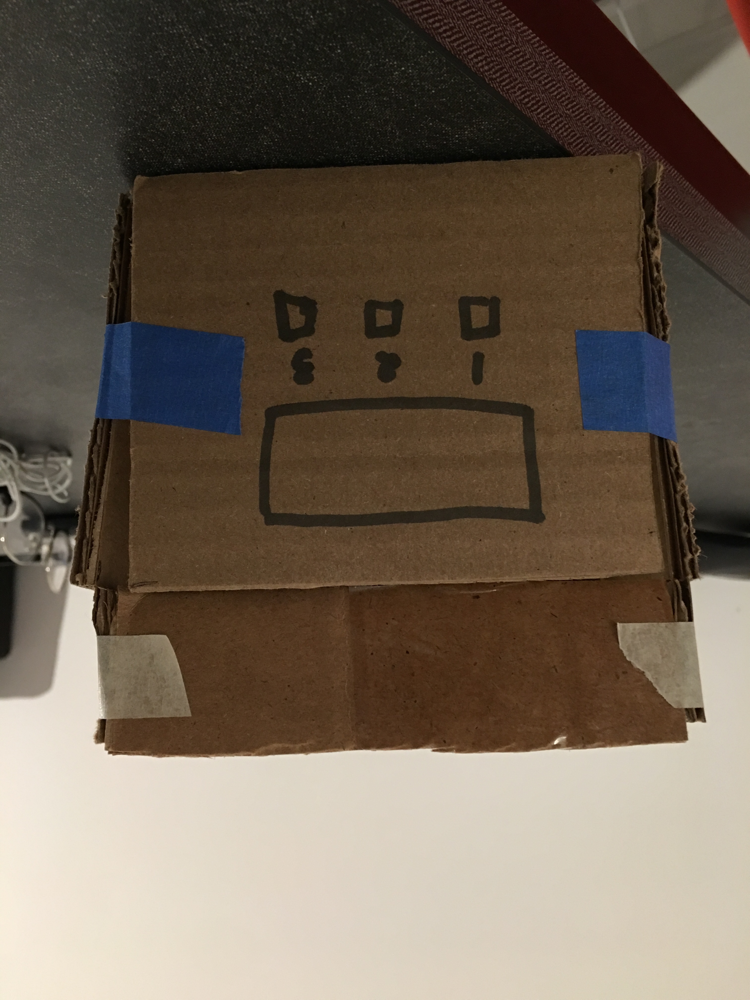

# IDD-FinalProject

## Paper Prototype

Idea: To build a digital lock box that opens when a correct combination of pins are pressed.  

Team: Hemanth Kondapalli  

Rough Form:  
  
  

Expected Parts:  
  1. Materials to build box: Wood, Nails, etc
  2. Hinge
  3. Arduino
  4. Switch Buttons
  5. Battery
  6. Sliding bolt lock
  7. Servo Motor
  8. LED

Assembly:  
I first have to laser cut the wood into a box tempalte. In this box template I want to create inserts in the box for the arduino buttons and the LED. After assembling the box with screws. I would have to build a circuit with the Arduino, switches, LED and Servo motor. I would place all these parts inside the box.

Interaction Plan:  
Users will be able to input a combination with the buttons on the box. The combination they enter will be displayed on the LED. If the combination is correct the box will open.
