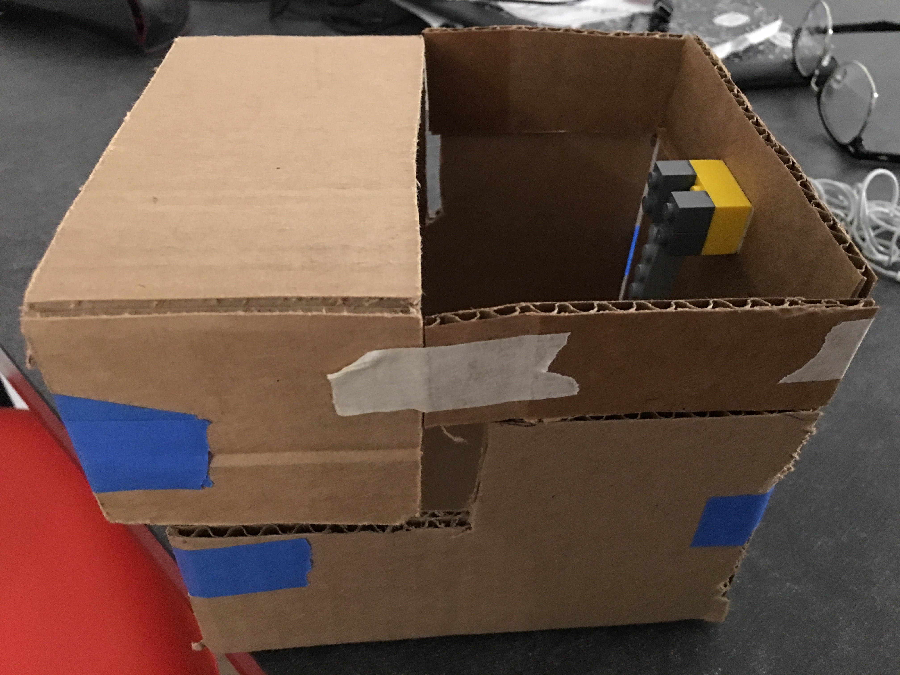
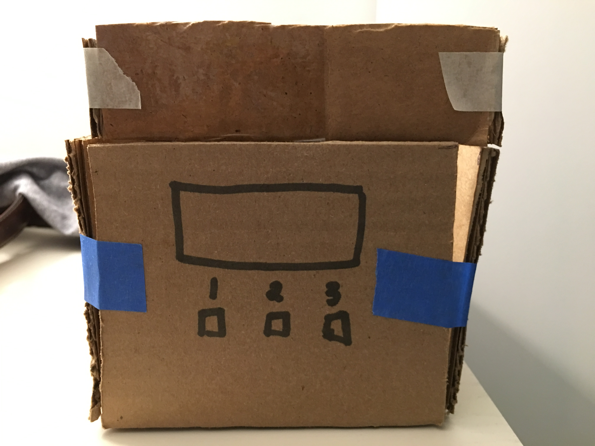
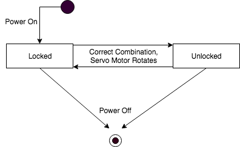
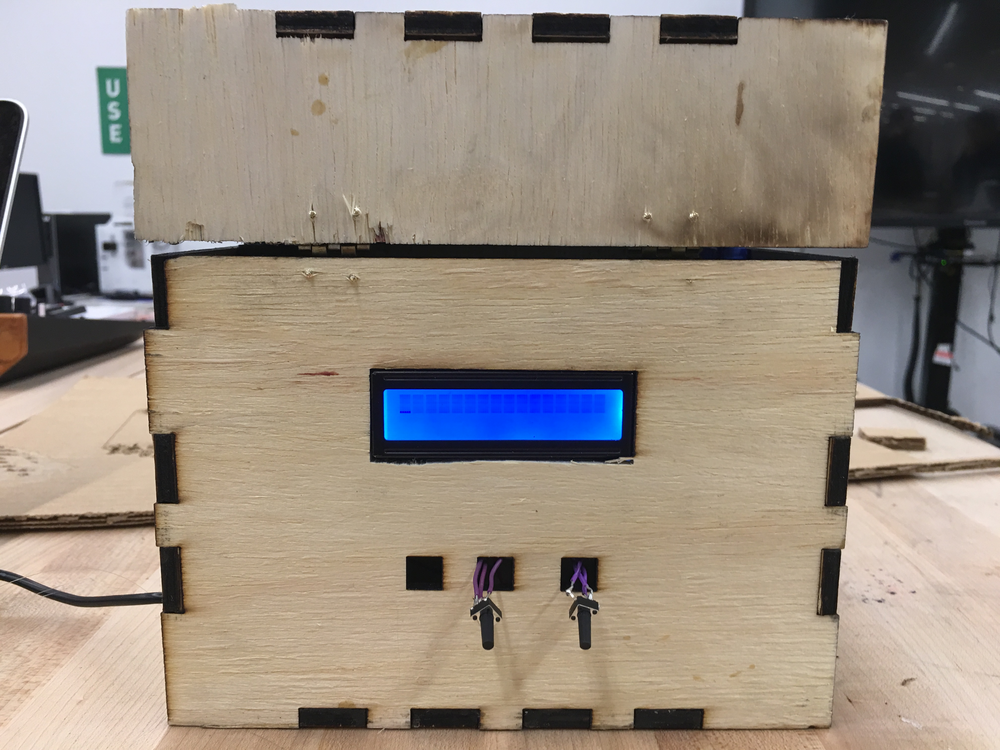
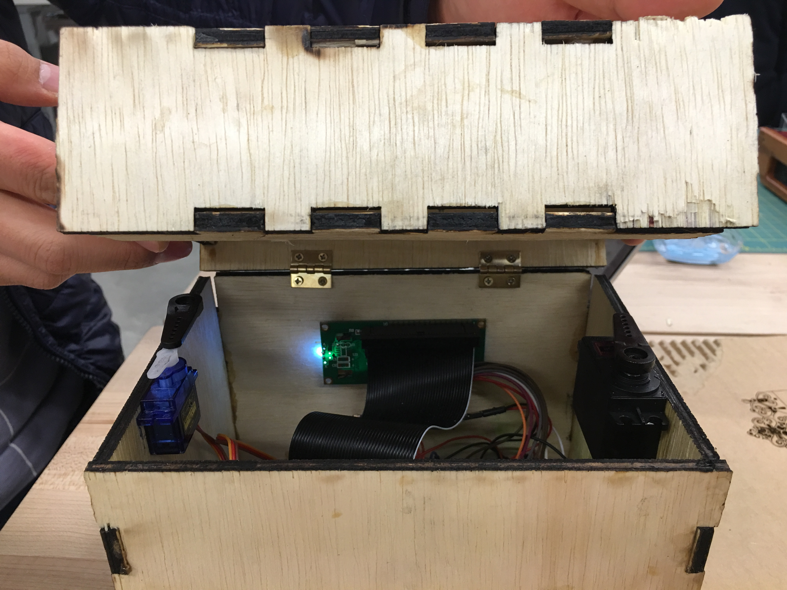
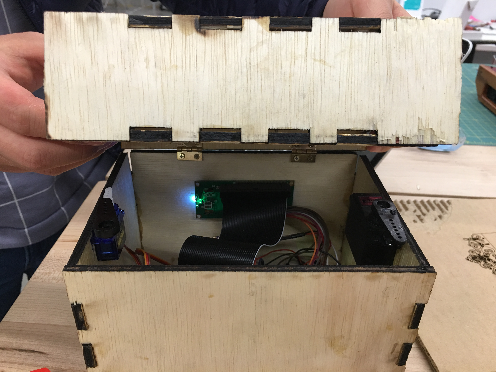
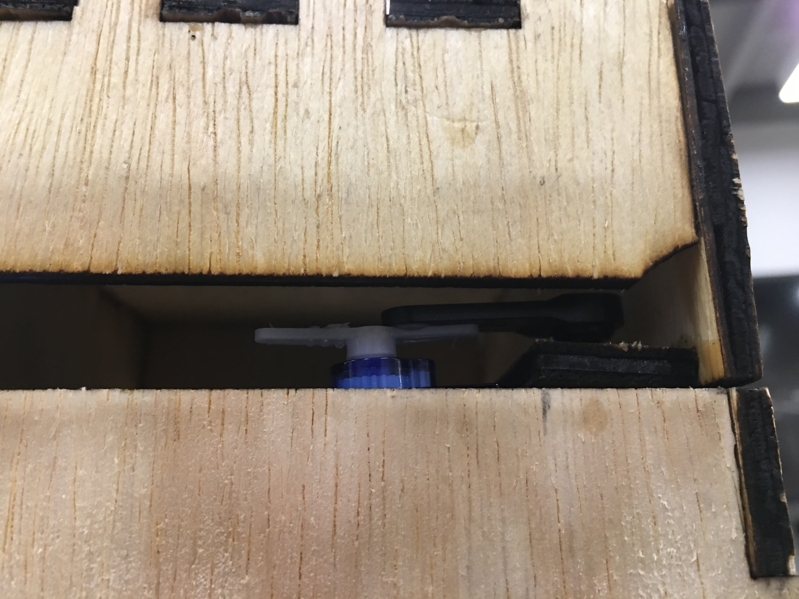

# IDD-FinalProject

## Paper Prototype

Idea: To build a digital lock box that opens when a correct combination of pins are pressed.  

Team: Hemanth Kondapalli  

Rough Form:  
 

Expected Parts:  
  1. Materials to build box: Wood, Nails, etc
  2. Hinge
  3. Arduino
  4. Switch Buttons
  5. Battery
  6. Sliding bolt lock
  7. Servo Motor
  8. LED

Assembly:  
I first have to laser cut the wood into a box tempalte. In this box template I want to create inserts in the box for the arduino buttons and the LED. After assembling the box with screws. I would have to build a circuit with the Arduino, switches, LED and Servo motor. I would place all these parts inside the box.

Interaction Plan:  
Users will be able to input a combination with the buttons on the box. The combination they enter will be displayed on the LED. If the combination is correct the box will open.

## Final Product

Parts: 
  1. 1/4 inch plywood 
  2. Hinge
  3. Extra Long Ribbon cable
  4. Switch Buttons
  5. Solder wire
  
Steps:
  1. Design a template on adobe illustrator for a box with a hinge and a ledge. Make sure the box has groves and edges which allow for parts to be wood glued togther. This should include measurements and appropriate space for the led screen, pins, arduino, servo motors and usb cable power connection. Iterate several times with carboard before you cut the wood.
  2. Build a circuit on the arduino board. The circuit should include the LED (connected via ribbon cable), 3 switch buttons and 2 servo motors. The circuit should allow for a user to input a 3 digit combination on the pins and if correct the servo should rotate.
  3. Laser cut the wood and wood glue the parts together. 
  4. Place the arduino board in the box and attach the servo motors to top portions of the box where the ledge will sit. Place and ensure that the motors are located and can rotate in such a way that they can enter both the locked and unlocked state as shown in the pictures below.
  5. Connect the LED to the ribon cable and place it in the mounted section of the box. 
  6. Using a small screwdriver connect the bottom of the box to the lid with the hinge. 
  
  State Diagram:  
   
  
  Pictures of the Box:
  
  Front of the Box                                     
           
   
   Side of the Box 
    
   
   Servo Arm when Locked and Unlocked 
        
   
   Servo Arm on Ledge  
    
  
  Final Video:
  
  [Link to Video](https://youtu.be/pa-ISmkXEoo)
  
  
  
  
